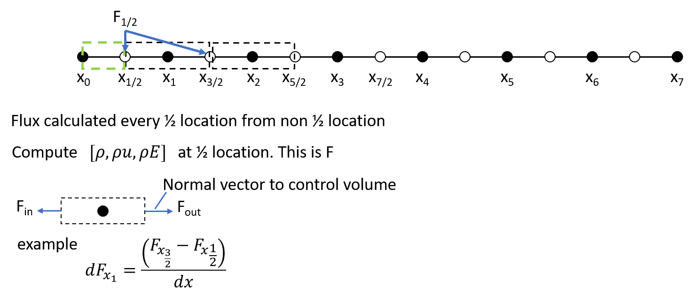

# AUSM+ Scheme with application to Shock Tube Problem
The purpose of this code is to demonstrate the solving of a shock tube using AUSM+

> Reference:
> Liou, M. S. (1996). A sequel to ausm: Ausm+. Journal of computational Physics, 129(2), 364-382.
> https://gitlab.grc.nasa.gov/ideas/pinn-torch/-/blob/main/references/Sequel%20to%20AUSM%20Part%20I_AUSM%2B%20JCP129_Liou(1).pdf

# Table of Contents
[TOC]

## Gas Properties
Total Energy
```math
E = \rho ( e + 1/2 u^2)
```

Internal Energy
```math
e = H - \frac{P}{\rho} = Cp T - \frac{P}{\rho} = Cp T - RT
```
## AUSM+ Flux Splitting
In this example we present a simple 1st Order Control Volume approach with Euler Timestep. 

### Governing Equations:
```math
\frac{\partial U}{\partial t} + \frac{\partial F}{\partial x} = 0
```
where $`U = [\rho, \rho u, \rho E]^T`$ These are the state variables.

```math
F = u
\begin{pmatrix} 
\rho \\
\rho u \\ 
\rho H 
\end{pmatrix}
+ 
\begin{pmatrix} 
0 \\
p \\ 
0 
\end{pmatrix}
```

### AUSM+ Procedure

Let j and j+1 states be given
1. Calculate the mach number at j and j+1 $`M_j`$ where $`M_j = u_j /a_{j+1/2}`$ and $`M_{j+1} = u_{j+1}/a_{j+1/2}`$
```python
a_star = a[i]
a_tilda_L = a_star**2 / np.max([a_star,np.abs(u[i])]) 
a_tilda_R = a_star**2 / np.max([a_star,np.abs(u[i+1])]) 
a_half = np.min([a_tilda_L, a_tilda_R])                 # This is a_{j+1/2}
```

2. Calculate the lower case mach number $`m_{j+1/2} = \textit{M}^{+}(M_j) + \textit{M}^{-}(M_{j+1})`$ and $`m_{j+1/2}^{\pm} = 1/2(m_{j+1/2} \pm |m_{j+1/2}|)`$ and $`P_{j+1/2} = \mathcal{P}^{+}(M_j)p_j + \mathcal{P}^{-}(M_{j+1})p_{j+1}`$ 
```python
M_plus,_ = M_plus_minus(u[i]/a_half)        # Calculates the mach number at i and i+1
_,M_minus = M_plus_minus(u[i+1]/a_half)
m_half = M_plus + M_minus  # Eqn 16 Interface mach number: M+(j) + M-(j+1) Note: this was derived from Eqn 13

m_half_plus = 0.5 *(m_half + np.abs(m_half))
m_half_minus = 0.5 *(m_half - np.abs(m_half))
P_alpha_plus, _ = P_alpha_plus_minus(M[i])
_, P_alpha_minus = P_alpha_plus_minus(M[i+1])
p_half = P_alpha_plus * P[i] + P_alpha_minus*P[i+1]  # Eqn 20b     
```

3. $`f_{j+1/2} = a_{j+1/2} (m^{+}_{j+1/2} * [\rho, \rho u, \rho h_t]_{j}^T + m^{-}_{j+1/2} * [\rho, \rho u, \rho h_t]_{j+1}^T]`$ + [0, p_{j+1/2}, 0]^T

```python
F_L[0] = r[i]
F_L[1] = r[i]*u[i] 
F_L[2] = r[i]*H[i]

F_R[0] = r[i+1]
F_R[1] = r[i+1]*u[i+1] 
F_R[2] = r[i+1]*H[i+1]

P_half[1] = p_half
F_half[:,i] = a_half * (m_half_plus * F_L + m_half_minus * F_R) + P_half # A1-A3 in AUSM+ paper 1 summary. 
```

AUSM+ provides a way to calculate the flux in between the nodes. This lets us integrate what goes in and out of each cell boundary. Flux is computed in between nodes or half point. 
<p align="center">
    
</p>


## How to Run the code 

The code can be executed by running `python main_ausm_plus.py` It will automatically create a folder called `analytical_plots`. An image of the solution at every 2 iterations will be saved into the folder. 


