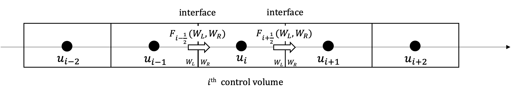
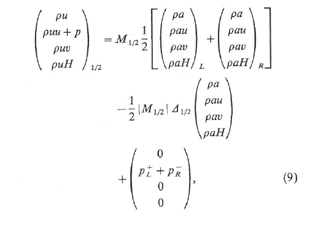
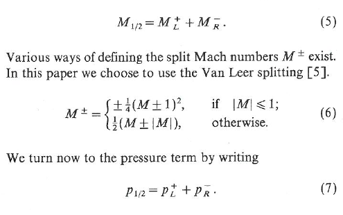
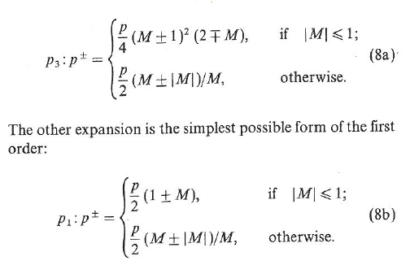

# AUSM Scheme for solving shocktube problems
The purpose of this code is to demonstrate the solving of a shock tube using AUSM. 

> Reference:
> M.-S. Liou and C. J. Steffen Jr., A new flux splitting scheme, J. Comput. Phys. 107, 23 (1993). First order scheme.
> https://gitlab.grc.nasa.gov/ideas/pinn-torch/-/blob/main/references/A%20new%20flux%20splitting%20scheme%20JCP%20107_Liou&Steffen.pdf

# Table of Contents
[TOC]
## Gas Properties
Total Energy
```math
E = \rho ( e + 1/2 u^2)
```

Internal Energy
```math
e = H - \frac{P}{\rho} = Cp T - \frac{P}{\rho} = Cp T - RT
```
## AUSM Flux Splitting
In this example we present a simple 1st Order Control Volume approach with Euler Timestep. 

### Governing Equations:
```math
\frac{\partial U}{\partial t} + \frac{\partial F}{\partial x} = 0
```

```math
F = u
\begin{pmatrix} 
\rho \\
\rho u \\ 
\rho H 
\end{pmatrix}
+ 
\begin{pmatrix} 
0 \\
p \\ 
0 
\end{pmatrix}
```

AUSM provides a way to calculate the flux in between the nodes. This lets us integrate what goes in and out of each cell boundary. Flux is computed in between nodes or half point. 
<p align="center">
    
</p>

The equation below is the calculation of Flux at 1/2 

<p align="center">
    
</p>

Mach 1/2 is used in the Flux 1/2 equation. Below is how to compute.

<p align="center">
    
</p>


Either definition of Pressure at the halfway points is fine. 

<p align="center">
    
</p>

## How to Run the code 

The code can be executed by running `python analytical-ausm.py` It will automatically create a folder called `analytical_plots`. An image of the solution at every 2 iterations will be saved into the folder. 

## AUSM Code 
```python
def flux_ausm(q:np.ndarray,gamma:float):
    """AUSM Flux Splitting Scheme
    
    References:
        Liou, M. S., & Steffen Jr, C. J. (1993). A new flux splitting scheme. Journal of Computational physics, 107(1), 23-39.
        https://github.com/PauloBarrosCorreia/AUSM/blob/master/ausm.f90 

    Args:
        q (np.ndarray): [3,nx] [rho, rhou, rhoE]
        gamma (float): ratio of specific heats 

    Returns:
        np.ndarray: Flux
    """
    # AUSM Mach Number 
    r = q[0,:]
    u = q[1,:]/r
    E = q[2,:]/r  # E = T*Cv # Kenji says maybe use Temperature instead of Energy then convert to Energy 

    P=(gamma-1.)*r*(E-0.5*u**2)
    a = np.sqrt(gamma*P/r)      
    M = u/a                     # Computes mach number at each location on the grid
    
    def M_plus_minus(M:float):
        """Equation 5

        Args:
            M (float): _description_

        Returns:
            _type_: _description_
        """
        if np.abs(M) <= 1:
            M_plus = 0.25*(M+1)**2
            M_minus = -0.25*(M-1)**2
        else:
            M_plus = 0.5*(M+np.abs(M))
            M_minus = 0.5*(M-np.abs(M))
        return M_plus, M_minus
    
    def P_plus_minus3(P:float, M:float):
        """Equation 8a

        Args:
            P (float): Pressure
            M (float): Mach 
        """
        if (np.abs(M)<=1):
            P_plus = 0.25*P * (M+1)**2 * (2-M)
            P_minus = 0.25*P * (M-1)**2 * (2+M)
        else:
            P_plus = 0.5*P * (M+np.abs(M))/M 
            P_minus = 0.5*P * (M-np.abs(M))/M 
        return P_plus, P_minus

    def P_plus_minus1(P:float,M:float):
        """Equation 8b

        Args:
            P (float): Pressure
            M (float): Mach
        """
        if (np.abs(M)<=1):
            P_plus = 0.5*P*(1+M)
            P_minus = 0.5*P*(1-M) 
        else:
            P_plus = 0.5*P*(M + np.abs(M)) / M
            P_minus = 0.5*P*(M - np.abs(M)) / M
        return P_plus, P_minus
    
    H = E+P/r
    F_half = np.zeros((3,q.shape[1]-1)) # rho*u, rho*u*u+P, rho*u*H
    F_L = np.zeros((3,))
    F_R = np.zeros((3,))
    P_L = np.zeros((3,))
    P_R = np.zeros((3,))
    for i in range(q.shape[1]-1):
        ML_plus,_ = M_plus_minus(M[i])
        _,MR_minus = M_plus_minus(M[i+1])
        M_half = ML_plus + MR_minus 
        
        PL_plus,_ = P_plus_minus1(P[i],M[i])
        _,PR_minus = P_plus_minus1(P[i+1],M[i+1])
        P_L[1] = PL_plus
        P_R[1] = PR_minus

        F_L[0] = r[i] * a[i]
        F_L[1] = r[i]*a[i]*u[i] 
        F_L[2] = r[i]*a[i]*H[i]

        F_R[0] = r[i+1] * a[i+1]
        F_R[1] = r[i+1]*a[i+1]*u[i+1] 
        F_R[2] = r[i+1]*a[i+1]*H[i+1]
        delta = F_R - F_L
        F_half[:,i] = M_half * 0.5*(F_L + F_R) - 0.5*np.abs(M_half)* delta + (P_L + P_R)
    
    return F_half
```


# Software Assurance
This is an analytical code based on a paper. Therefore software assurance was checked by comparing the results against the results of a similar paper, the Roe Scheme. Roe scheme is used because it provides a very accurate representation of the discontiunities near the shock front. Roe is expensive to compute which is why researchers are interested in other methods.

## AUSM Scheme


## Roe Scheme


